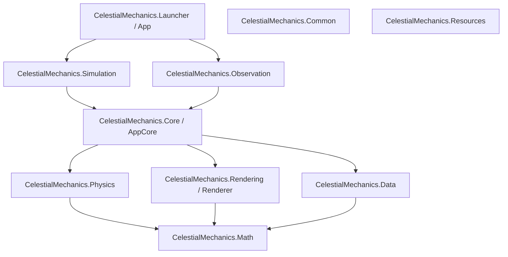

# Celestial Mechanics - System Architecture

This document describes the high-level architecture and system components of the Celestial Mechanics application.

## 1. System Overview

Celestial Mechanics is a .NET 8 desktop application written in C# designed to perform high-performance celestial body physics simulations and visualizations. The system is designed with a highly modular, decoupled architecture, separating mathematical calculations, physics equations, data loading, rendering, and mode-specific runtime logic.

The codebase consists of two completely independent operating modes:
1. **Simulation Mode** (Existing): An interactive 3D universe editor and physics simulation sandbox.
2. **Observation Mode** (Future): A scientific astronomy visualization engine using real data (NASA JPL, Gaia).

Both modes must share engine libraries only and must never depend on each other.

## 2. Core Architecture Principles

To support long-term maintainability and AI-assisted development, all system designs adhere to:
* **Single Responsibility Principle**: Each assembly has a singular, well-defined scope.
* **Loose Coupling**: Components interface through abstractions rather than direct concretes.
* **No Circular Dependencies**: All project references follow a strict top-down directional flow.
* **Separation of Concerns**: UI, Rendering, Physics, and Data layers remain strictly separated.

## 3. Projects & Modules

* **CelestialMechanics.Core / AppCore**: Orchestrates application lifecycle, scene graph management, selection context, modes, and sandbox serialization without UI dependencies.
* **CelestialMechanics.Math**: High-performance linear algebra, coordinate transformations, and precision math routines.
* **CelestialMechanics.Physics**: Implementation of gravitational equations, integration schemes (Euler, Verlet, Runge-Kutta), and collision checkers.
* **CelestialMechanics.Rendering / Renderer**: High-performance 3D visualization layer built on top of Silk.NET and OpenGL.
* **CelestialMechanics.Data**: External file serialization, scenario persistence, and catalog ingestion utilities.
* **CelestialMechanics.Common**: Shared common utilities, logging helpers, and engine interface definitions.
* **CelestialMechanics.Resources**: Textures, shader source files, icons, and static assets.
* **CelestialMechanics.Simulation**: Specific logic, editors, views, and ViewModels for the Interactive Simulation Mode.
* **CelestialMechanics.Observation**: Scientific astronomy visualizer, database query adapters, and planetary system streaming layers.
* **CelestialMechanics.Launcher / Desktop / App**: Entry point application that manages bootstrapping and mode launching.
