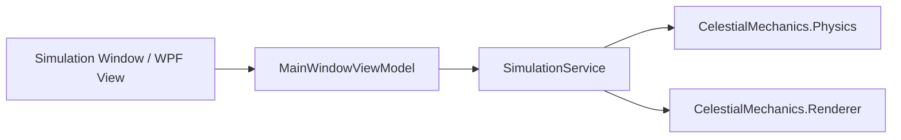

# Simulation Mode Architecture

This document describes the architectural flow, component relationships, and lifecycle of the interactive Simulation Mode.

## 1. Architectural Layout

Simulation Mode is implemented as a standard desktop application using the Model-View-ViewModel (MVVM) pattern in WPF, with a Silk.NET OpenGL rendering viewport overlaid.

## 2. Component Roles

- **View Layer**: Managed in `CelestialMechanics.Desktop` views. Composed of property panel sidebars, scene hierarchy tree views, save/load file options, and an OpenGL window integration context.
- **ViewModel Layer**: Managed in `CelestialMechanics.Simulation`. Orchestrates user commands, bindings, selection state updates, and controls simulation settings.
- **Service Layer**: Handles coordination between the WPF UI thread, rendering loop scheduler, and the core physics integration thread.
- **Solvers**: Multi-threaded integrators resolving gravitational attractions.
